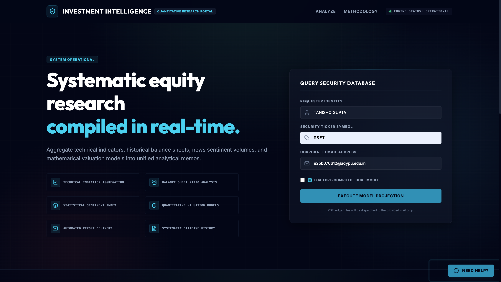
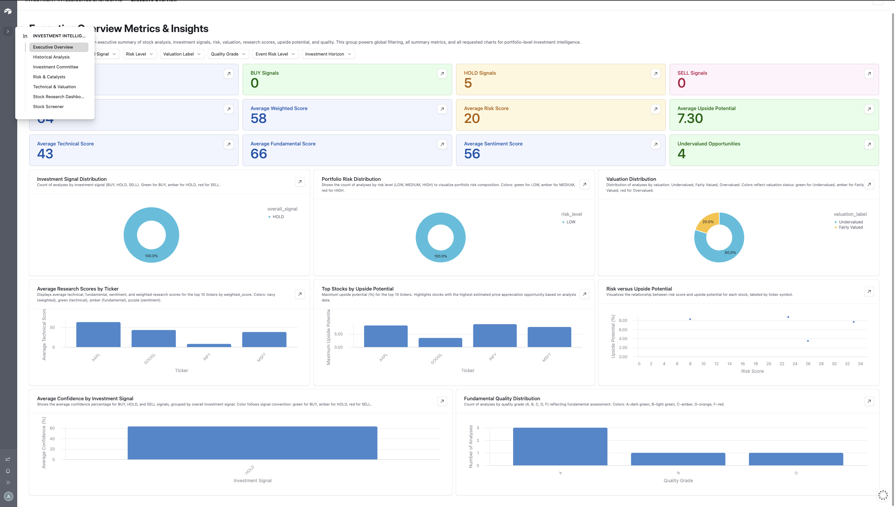
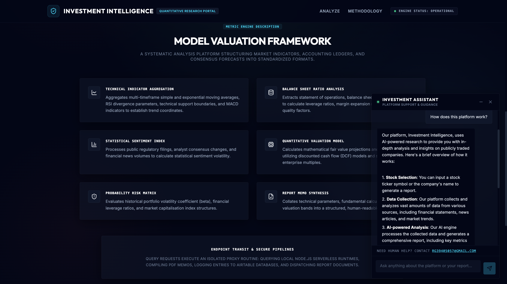
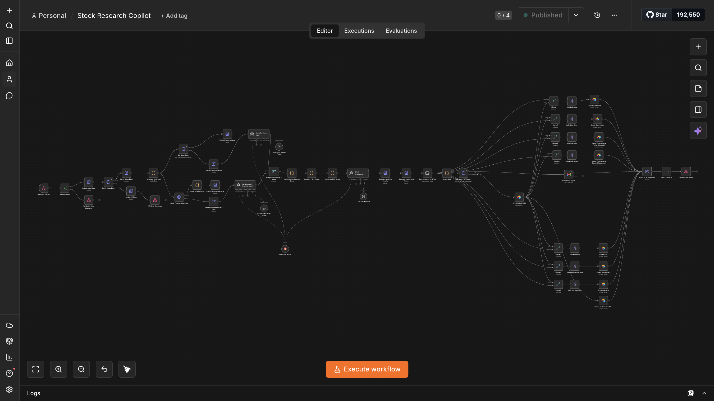
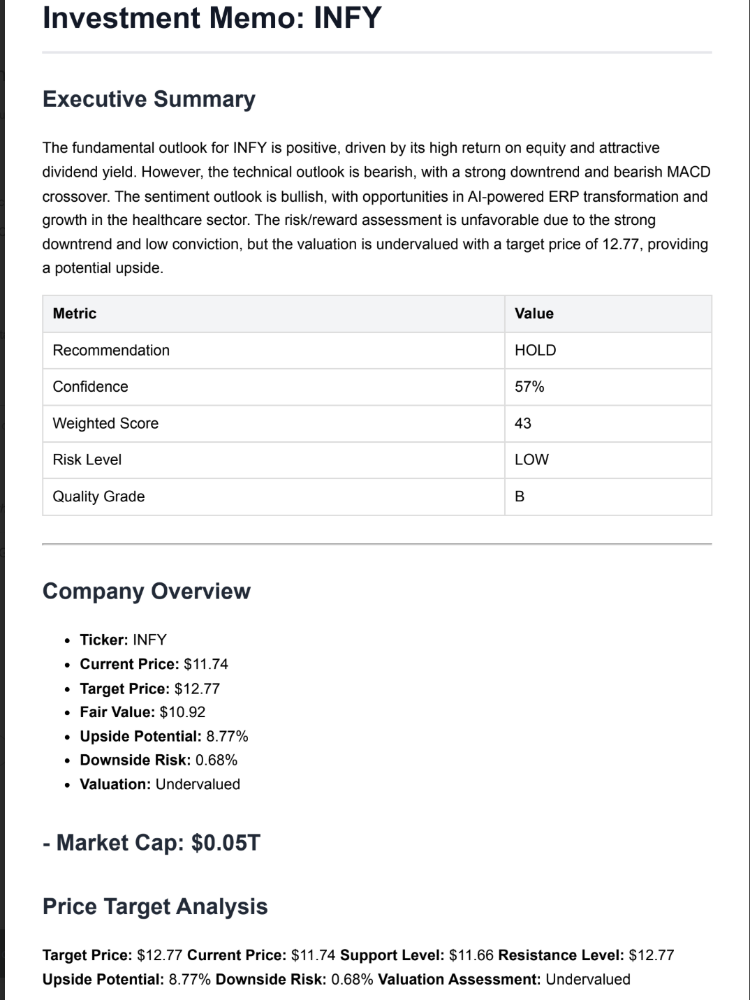

# INVESTMENT-INTELLIGENCE

An AI-powered investment research platform that automates stock analysis, generates a structured investment memo, delivers a PDF report by email, stores research data in Airtable, and presents the results through an interactive web dashboard.

The project combines financial-data APIs, AI agents, workflow automation, document generation, data storage, and a production-ready React interface into one end-to-end system.

## Live Application

Live Demo: `ADD_YOUR_VERCEL_URL_HERE`

GitHub Repository: `https://github.com/Shivgg1234/INVESTMENT-INTELLIGENCE`

## Project Overview

Stock Research Copilot allows a user to submit:

- Full name
- Stock ticker
- Email address

The platform then performs a complete automated stock-research workflow that includes:

- Market-data collection
- Technical analysis
- Fundamental analysis
- News and sentiment analysis
- Risk assessment
- Valuation analysis
- Investment recommendation generation
- PDF investment memo generation
- Email delivery
- Airtable data storage
- Interactive dashboard visualization

The application is designed as a portfolio-grade automation project demonstrating frontend development, API integration, AI agents, workflow orchestration, document automation, database design, and deployment.

## Key Features

### Automated Stock Analysis

The workflow collects stock and market data and calculates:

- Current price
- Moving averages
- RSI
- MACD
- Momentum
- Volatility
- Support and resistance levels
- Upside potential
- Downside risk
- Risk-reward ratio

### AI-Powered Research Agents

The n8n workflow uses AI agents for:

- Fundamental analysis
- News sentiment analysis
- Risk analysis
- Valuation assessment
- Investment thesis generation
- Final CIO-style recommendation

### Structured Investment Output

The final response contains:

- BUY, HOLD, or SELL signal
- Recommendation
- Confidence percentage
- Weighted score
- Technical score
- Fundamental score
- Sentiment score
- Risk score
- Risk level
- Valuation label
- Bull case
- Bear case
- Key risks
- Key opportunities
- Entry strategy
- Exit strategy
- Portfolio allocation
- Investment horizon

### PDF Report Generation

The platform converts the generated investment memo into a professionally formatted PDF containing:

- Executive summary
- Company overview
- Price-target analysis
- Technical analysis
- Fundamental analysis
- News intelligence
- Risk assessment
- Bull and bear cases
- Investment strategy
- Final recommendation
- Disclaimer

### Email Delivery

The generated PDF is automatically sent to the email address submitted by the user.

### Airtable Research Database

Research results are stored in a relational Airtable base using the following tables:

- `stock_analysis`
- `bull_case`
- `bear_case`
- `risks_opportunities`
- `technical_metrics`
- `fundamental_factors`

Child records are linked to their parent stock-analysis record using Airtable linked-record fields.

### Airtable Executive Dashboard

The Airtable Interface provides:

- Executive overview
- Stock screener
- Signal distribution
- Risk distribution
- Valuation distribution
- Technical-score comparison
- Fundamental-score comparison
- Sentiment-score comparison
- Historical research tracking
- Risk and opportunity monitoring
- Investment committee views

### Interactive React Dashboard

The web application displays:

- Current price
- Target price
- Fair value
- Upside potential
- Downside risk
- Confidence
- Risk level
- Scorecards
- Valuation charts
- Risk charts
- Bull and bear factors
- Opportunities and risks
- Investment thesis

### Customer Support Chatbot

The application includes an AI-powered support chatbot that helps users:

- Generate a stock report
- Understand stock ticker symbols
- Understand dashboard metrics
- Understand PDF delivery
- Resolve common report-generation problems
- Interpret technical, fundamental, sentiment, and risk scores

The chatbot uses a server-side Hugging Face integration and does not expose API credentials in the browser.

## System Architecture

```text
User
  |
  v
React and Vite Frontend
  |
  v
Vercel Serverless API
  |
  v
n8n Production Webhook
  |
  +--> Market Data APIs
  |
  +--> Technical Indicator Engine
  |
  +--> Fundamental Analysis Agent
  |
  +--> News Sentiment Agent
  |
  +--> Valuation and Risk Engine
  |
  +--> CIO Recommendation Agent
  |
  +--> PDF Generation
  |
  +--> Gmail Delivery
  |
  +--> Airtable Database
  |
  v
Interactive Result Dashboard
```

## Technology Stack

### Frontend

- React.js
- Vite
- JavaScript
- Tailwind CSS
- Recharts
- Lucide React

### Backend and Automation

- n8n
- Vercel Serverless Functions
- REST APIs
- Webhooks

### AI and Language Models

- Hugging Face Inference API
- Llama 3.1
- Groq or compatible LLM providers
- Structured Output Parsers
- AI agents and prompt pipelines

### Data and Integrations

- Yahoo Finance API
- News API
- Airtable
- Gmail
- HTML-to-PDF API

### Deployment

- GitHub
- Vercel
- n8n Cloud or self-hosted n8n

## Project Structure

```text
Stock-Research-Copilot/
├── api/
│   ├── analyze.js
│   └── chat.js
├── public/
├── src/
│   ├── components/
│   │   ├── chat/
│   │   ├── AnalysisForm.jsx
│   │   ├── ErrorState.jsx
│   │   ├── FactorList.jsx
│   │   ├── Footer.jsx
│   │   ├── Header.jsx
│   │   ├── Hero.jsx
│   │   ├── LoadingState.jsx
│   │   ├── MetricCard.jsx
│   │   └── ResultsDashboard.jsx
│   ├── services/
│   │   ├── analysisApi.js
│   │   └── chatApi.js
│   ├── utils/
│   │   ├── formatters.js
│   │   └── normalizeAnalysis.js
│   ├── App.jsx
│   ├── index.css
│   └── main.jsx
├── workflow/
│   └── stock-research-copilot.json
├── screenshots/
├── .env.example
├── .gitignore
├── eslint.config.js
├── index.html
├── package.json
├── package-lock.json
├── vercel.json
├── vite.config.js
└── README.md
```

## Application Workflow

1. The user enters a name, ticker, and email address.
2. The React application sends the request to `/api/analyze`.
3. The Vercel serverless function validates the input.
4. The serverless function securely calls the n8n production webhook.
5. n8n retrieves stock and news data.
6. Technical indicators are calculated.
7. AI agents perform fundamental, sentiment, risk, and valuation analysis.
8. A final investment recommendation is generated.
9. The investment memo is converted into HTML.
10. The HTML report is converted into a PDF.
11. The PDF is sent to the requester through Gmail.
12. The analysis is stored in Airtable.
13. The structured result is returned to the React dashboard.

## Local Setup

### Prerequisites

Install:

- Node.js
- npm
- Git
- Vercel CLI
- Access to an active n8n workflow

### Clone the Repository

```bash
git clone ADD_YOUR_GITHUB_REPOSITORY_URL
cd Stock-Research-Copilot
```

### Install Dependencies

```bash
npm install
```

### Create Environment Variables

Create a `.env.local` file in the project root:

```env
N8N_WEBHOOK_URL=https://your-n8n-domain/webhook/stock-research
N8N_API_KEY=
HF_TOKEN=
HF_MODEL=meta-llama/Llama-3.1-8B-Instruct
```

Do not expose these values in frontend code.

### Start the Frontend Only

```bash
npm run dev
```

This starts the Vite frontend.

### Start the Complete Local Application

```bash
vercel dev
```

This runs:

- React frontend
- `/api/analyze`
- `/api/chat`

## Environment Variables

| Variable          | Purpose                                      |
| ----------------- | -------------------------------------------- |
| `N8N_WEBHOOK_URL` | n8n production webhook URL                   |
| `N8N_API_KEY`     | Custom header secret used by the n8n webhook |
| `HF_TOKEN`        | Hugging Face inference token                 |
| `HF_MODEL`        | Hugging Face model identifier                |

The `N8N_API_KEY` is a custom webhook secret and not the n8n account API key.

## Deployment

### Deploy with Vercel CLI

```bash
npm run build
vercel --prod
```

### Deploy through GitHub

1. Push the repository to GitHub.
2. Import the repository into Vercel.
3. Add all required environment variables.
4. Deploy the project.
5. Confirm that the n8n production workflow is active.

## Security Measures

The project uses the following security practices:

- API secrets are stored in server-side environment variables.
- The frontend does not call n8n directly.
- The n8n webhook uses header authentication.
- Hugging Face tokens are never exposed in browser code.
- User input is validated before reaching n8n.
- Error responses do not expose internal stack traces.
- Environment files are excluded through `.gitignore`.
- Sensitive credentials are not stored in the repository.
- Chat history is not permanently stored in the browser.

## Data Validation

The application validates:

- Required name
- Valid email format
- Valid ticker format
- Ticker length
- Empty requests
- Missing API configuration
- Invalid API responses
- Network and timeout failures

## Percentage Handling

Percentage values are stored as percentage points.

Examples:

```text
13.44 means 13.44%
0.20 means 0.20%
```

The frontend does not multiply these values by 100.

## Error Handling

The system includes handling for:

- Invalid ticker input
- Missing form fields
- Financial API failures
- News API failures
- AI-provider failures
- Structured-output failures
- PDF-generation failures
- Airtable errors
- Gmail delivery errors
- Serverless API failures
- Request timeouts

Users receive safe and readable error messages instead of internal system details.

## Screenshots

### Landing Page



### Result Dashboard



### Support Chatbot



### Airtable Dashboard


### n8n Workflow



### PDF Report


## Engineering Highlights

This project demonstrates:

- End-to-end workflow automation
- Multi-agent AI orchestration
- Structured AI output
- REST API integration
- Webhook-based architecture
- Technical-indicator calculation
- Relational Airtable data modelling
- Automated document generation
- Automated email delivery
- Secure serverless API design
- Interactive financial-data visualization
- Production deployment
- Error handling and data normalization

## Limitations

- The platform depends on third-party financial-data and AI services.
- Market data may be delayed or incomplete.
- AI-generated analysis may contain inaccuracies.
- Valuation outputs are estimates and not guaranteed predictions.
- The application does not execute trades.
- The application does not provide personalized financial advice.
- External API limits may affect availability.

## Future Improvements

Planned improvements include:

- User authentication
- Saved report history
- Secure per-user report pages
- Background job processing
- Request-status tracking
- Automated retry logic
- Rate limiting
- Bot protection
- Portfolio-level analysis
- Multi-stock comparison
- Real-time market-data streaming
- Automated monitoring and failure alerts
- Additional financial-data providers

## Disclaimer

This application is intended for informational and educational purposes only.

It does not provide financial, investment, legal, or tax advice. AI-generated analysis and third-party market data may contain errors, become outdated, or be incomplete. Users should conduct independent research and consult a qualified financial professional before making investment decisions.

## Author

Tanishq Gupta

GitHub: `https://github.com/Shivgg1234`

LinkedIn: `https://www.linkedin.com/in/tanishq-gupta-981050383/`
